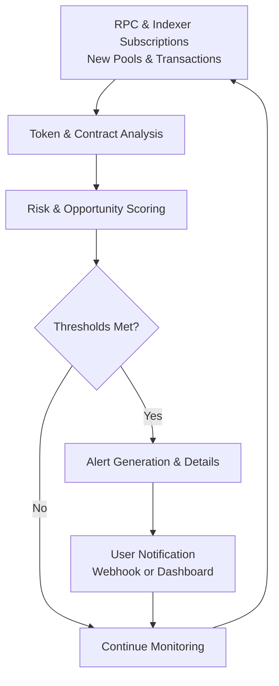

# Token Radar Bot

Deploy Token Radar Bot as a high-frequency on-chain monitoring and token discovery execution layer for new launches, liquidity events, volume spikes, and smart money tracking across Solana, Ethereum, and major DEXes with customizable alerts and analytics.

### Introduction to Crypto Token Discovery Systems

The crypto market sees thousands of new tokens launched daily, making timely discovery and monitoring critical. A **Token Radar Bot** functions as a specialized **on-chain event listener and token intelligence engine** that scans for new liquidity pools, large transactions, and suspicious activity in real time.

Traders, snipers, and project analysts use these tools to stay ahead of market movements and identify high-potential opportunities or risks.

### Inside the System: Core Mechanism

The bot operates as a **high-speed RPC subscription and event analysis layer**. It monitors:

- New token deployments and liquidity additions (e.g., Raydium, Uniswap)
- Large wallet movements and whale transactions
- Volume spikes and price action anomalies
- Smart contract interactions and potential rug indicators

Signals are scored based on customizable criteria and delivered via alerts or integrated into trading workflows. Advanced versions include AI-based pattern recognition and historical performance correlation.

  

### Target Audience and Practical Use Cases

This execution layer targets:
- Memecoin and new launch hunters
- On-chain analysts and researchers
- Automated trading bot operators
- Project teams monitoring competitor activity

Common applications include:
- **Early detection** of promising token launches
- **Whale and smart money tracking**
- **Rug-pull risk assessment**
- **Market sentiment and volume analysis**

### Technical Architecture and Operational Logic

A robust Token Radar Bot includes:

- **Event Subscription Layer**: Real-time RPC and indexer connections
- **Token Analysis Engine**: Contract scanning, liquidity checks, and risk heuristics
- **Alert & Scoring Module**: Prioritized notifications with confidence levels
- **Historical Database**: Performance tracking and pattern learning
- **Integration Hub**: Webhooks for trading bots and dashboards

**Operational Logic Flowchart**

### Key Features and Technical Advantages

- **Ultra-Fast Detection**: Sub-second alerts for new launches and major events
- **Multi-Chain Support**: Solana, Ethereum, Base, and emerging ecosystems
- **Custom Filters**: Volume, liquidity, dev wallet activity, and more
- **Risk Scoring**: Honeypot detection and rug risk indicators
- **Integration Ready**: Easy webhook support for trading automation

The system provides a significant edge through speed and comprehensive on-chain intelligence.

### Deployment Profile and Getting Started

1. **Infrastructure**: Reliable high-speed RPC providers and stable hosting.
2. **Configuration**: Set target chains, filters, and alert channels.
3. **Testing**: Monitor known active periods and validate signal quality.
4. **Integration**: Connect webhooks to trading bots or notification services.
5. **Monitoring**: Regularly review and refine filters based on performance.

Many solutions offer web dashboards or self-hosted options with clear setup guides.

### Conclusion

The Token Radar Bot serves as a powerful on-chain intelligence and discovery execution engine for navigating the fast-paced crypto token market. Its value lies in real-time monitoring, customizable alerts, and risk analysis rather than any guaranteed profitable signals. For informed traders and analysts who combine it with rigorous due diligence and risk management, it provides a significant operational advantage in token discovery and market awareness.

### FAQ

**How fast does a Token Radar Bot detect new launches?**  
High-quality implementations provide near-instant alerts using direct RPC subscriptions, though slight delays can occur during extreme network activity.

**Does it work on Solana and Ethereum?**  
Yes. Leading bots support major chains with specialized logic for each ecosystem’s launch mechanisms.

**Can it help avoid rug pulls?**  
It flags common red flags through heuristics, but no tool offers 100% protection. Always perform manual verification.

**Is it suitable for beginners?**  
It is best for users with basic crypto knowledge. Beginners should start with conservative settings and focus on learning token evaluation.

**What are the main costs?**  
Premium RPC subscriptions, hosting (if self-hosted), and potential trading fees when acting on signals. Many basic monitoring tools have free tiers.
